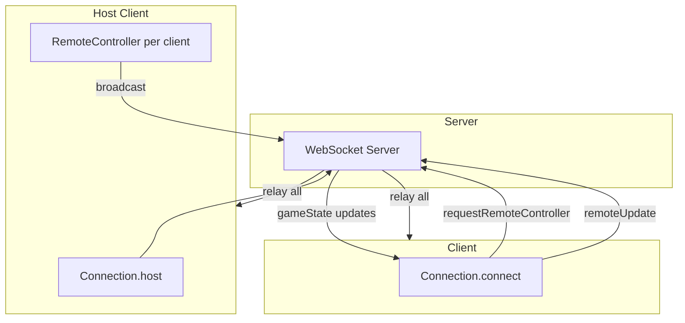

# Client-Server Architecture

How miniplay-js connects players and the server.

---

## Transport Layer

| Transport | Role | Config |
|-----------|------|--------|
| **WebSocket** | Primary | `config.network.webSocketIp` (default `ws://localhost:8080`) |
| **WebRTC** | Optional | `config.network.webRTC` toggles `WebRTCHandler` with data channel |
| **REST** | Minimal | Express serves `/ping` and static files from `public/` |

---

## Server Model

- **HTTP** + **WebSocket** (ports configurable, e.g. 3000, 8080)
- Simple relay: every connected client receives every message (broadcast)
- No game logic on server—pure message relay

---

## Connection Model

| Role | Method | Behavior |
|------|--------|----------|
| **Host** | `Connection.host()` | Connects, becomes authority, spawns clients |
| **Client** | `Connection.connect(ip)` | Connects, requests control of a player |
| **RemoteController** | Created by host per client | Routes `remoteUpdate` to the correct player |

- **Static class:** Single `Connection` instance; `subscribers` and `syncSubscribers` Maps for event dispatch.

---

## Message Protocol

**Format:** JSON `{ eventType: NetworkEventType, payload: {...} }`

| Event Type | Direction | Purpose |
|------------|-----------|---------|
| `textMessage` | Bidirectional | Chat |
| `gameState` | Host → Clients | Sync (create, tileMap, start, update, stop) |
| `requestRemoteController` | Client → Host | Request player spawn |
| `remoteUpdate` | Client → Host | Position, animation, actions |

**API:**
- Host → clients: `Connection.sendHostGameUpdate(eventType, updateType?, data?, onNewConnection?)`
- Client → host: `Connection.sendClientRemoteControlUpdate(payload)`
- Subscribe: `subscribeNetworkEvent()` (one-time), `subscribeHostGameUpdate()` (sync updates)
- **Debounce:** `Connection.minPingCheck(id)` throttles network sends (e.g. 30 ticks)

---

## Host-Client Flow

1. Host calls `Connection.host()` → connects → `handleOnOpen`
2. Client calls `Connection.connect(ip)` → sends `requestRemoteController` with `nId`
3. Host subscribes to `requestRemoteController` → callback spawns player, creates `RemoteController`
4. Client sends `remoteUpdate` (position, animation, actions) → host routes to `RemoteController`
5. Host broadcasts via `gameState` to other clients
6. On disconnect: `HostGameUpdateType.stop` → `onConnectionLost` (e.g. reload)

---

## Flow Diagram

---

## Key Modules

- `Connection` — networking API
- `ConnectionInterface` — `NetworkEventType`, `HostGameUpdateType`, `ClientGameUpdateType`
- `RemoteController` — host-side remote client handling, routes updates to players

---

[← Back to index](README.md)
